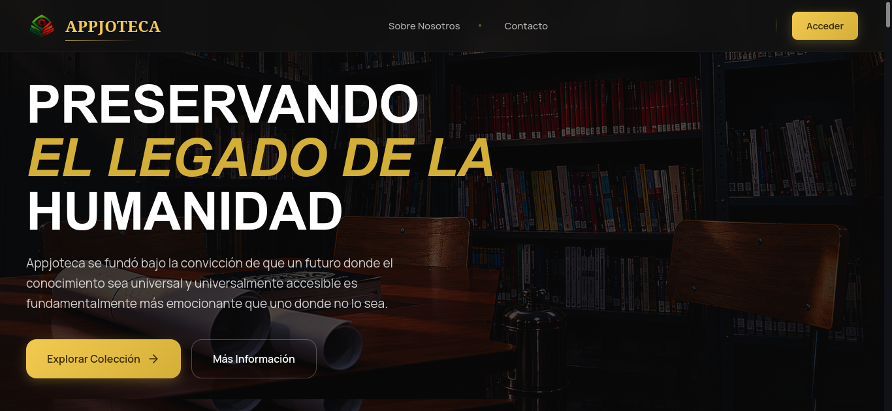
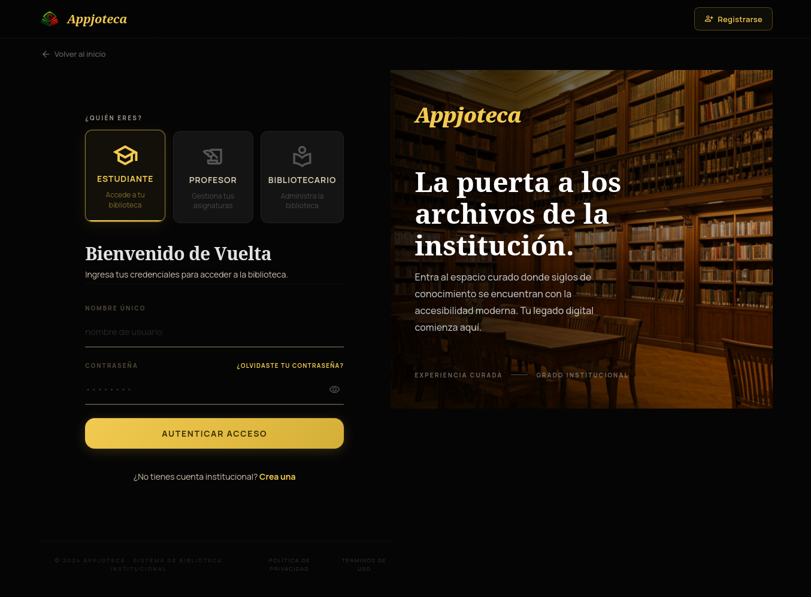
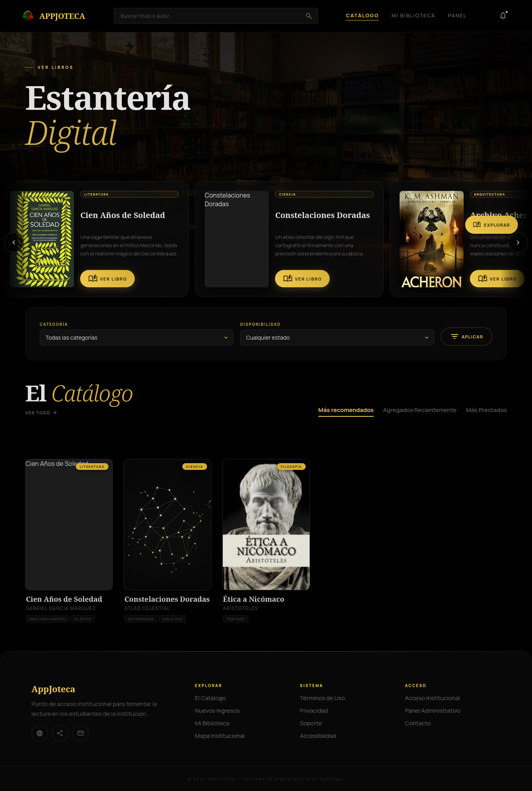
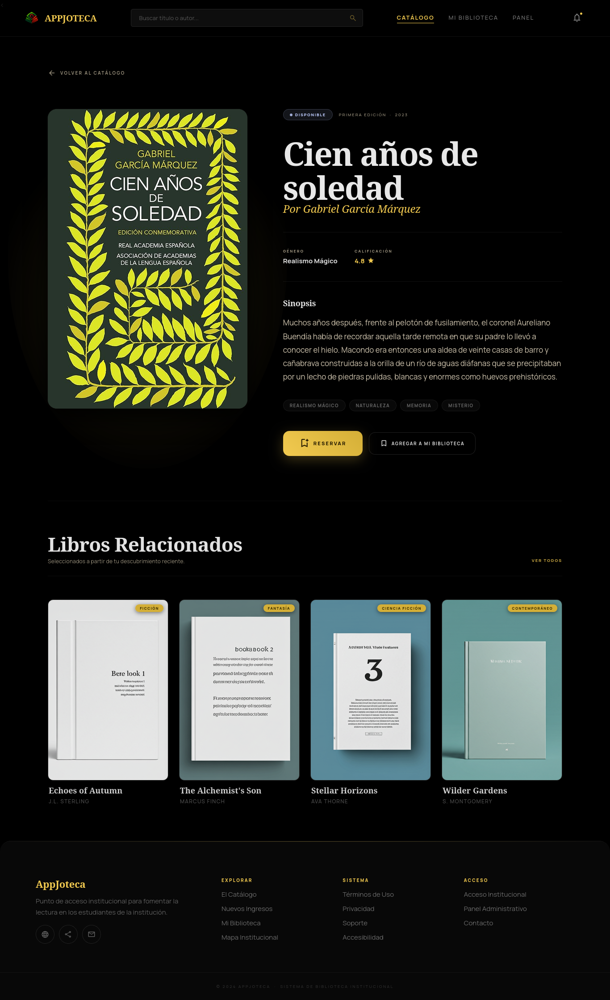

  


  # AppJoteca

  > **Sistema web moderno para la gestión y consulta de los recursos de una biblioteca escolar.**

  [](https://opensource.org/licenses/Apache-2.0)
  
  
  
  
  
  
  
  


---

## 📖 Acerca del Proyecto

**AppJoteca** es una aplicación web desarrollada como Proyecto Integrador de Aula (PIA) para la **Institución Educativa Manuel J. Betancur**. Su misión principal es transformar y digitalizar la gestión de la biblioteca escolar.

El sistema facilita la administración del inventario, la consulta interactiva del catálogo, la gestión de reservas y la administración de usuarios, todo bajo una interfaz fluida, responsiva y adaptable a computadoras, tablets y móviles.

### ✨ Características Principales
* 🔐 **Seguridad:** Autenticación, registro y control de acceso basado en roles.
* 📚 **Gestión Integral:** Administración del inventario bibliográfico y visualización detallada de cada libro.
* 📅 **Reservas:** Solicitud, gestión y estado de reservaciones en tiempo real.
* 📊 **Estadísticas:** Paneles de usuario diferenciados con reportes e historial de actividades.
* 📱 **Diseño Responsivo:** Interfaz moderna que se adapta a cualquier tamaño de pantalla.

---

## 🎭 Roles del Sistema

| Rol | Capacidades | Paneles y Accesos |
| :--- | :--- | :--- |
| 🛡️ **Bibliotecario** | Administrador total del sistema. Gestiona libros, préstamos y usuarios. | Dashboard, Inventario, Usuarios, Reservaciones, Reportes y Ajustes. |
| 🎓 **Estudiante** | Usuario estándar. Puede explorar y solicitar material educativo. | Dashboard, Catálogo, Reservaciones, Historial y Ajustes. |
| 👨‍🏫 **Docente** | Usuario educativo. Acceso a material de apoyo y reservas. | Dashboard, Catálogo, Reservaciones, Historial y Ajustes. |

---

## 🛠️ Tecnologías Utilizadas

* **Frontend:** HTML5, CSS3 (Custom Properties & Diseño Modular), JavaScript (ES6+).
* **UI & Animaciones:** GSAP, SweetAlert2, Material Symbols & Icons.
* **Backend:** PHP 8.x, PHPMailer (para gestión y envío de correos).
* **Base de Datos:** MySQL.
* **Dependencias y Entorno:** Composer, XAMPP (Apache), vlucas/phpdotenv.

---

## 🎨 Referencia de Colores

| Color | Hex | Muestra |
| :--- | :--- | :--- |
| **Background** | `#000000` |  |
| **Surface** | `#0d0d0d` |  |
| **Primary** | `#f2ca50` |  |
| **Secondary** | `#c9c6c5` |  |
| **Tertiary** | `#bfcdff` |  |
| **Error** | `#ffb4ab` |  |
| **Text (On Surface)**| `#e2e2e2` |  |

---

## 🚀 Instalación y Ejecución Local

Sigue esta guía paso a paso para desplegar el proyecto en tu máquina.

### 1. Preparar el entorno (Git, PHP y MySQL)

**Haz clic aquí para ver el tutorial completo de instalación de Git y del entorno de servidor**

---
##

**A. Instalación y Configuración de Git**

1. Descarga Git desde [git-scm.com](https://git-scm.com/) e instálalo dejando las opciones por defecto.
2. Verifica que la instalación fue exitosa:
   ```bash
   git --version
   ```
3. Configura tu identidad (necesaria para hacer commits):
   ```bash
   git config --global user.name "Tu Nombre"
   git config --global user.email "tu@email.com"
   ```
4. (Opcional pero recomendado) Configura el editor por defecto y el nombre de la rama principal:
   ```bash
   git config --global init.defaultBranch main
   git config --global core.editor "code --wait"
   ```
5. (Opcional) Genera una llave SSH para no tener que autenticarte con usuario y contraseña en cada `push`/`pull`:
   ```bash
   ssh-keygen -t ed25519 -C "tu@email.com"
   ```
   Luego agrega la llave pública generada en **GitHub → Settings → SSH and GPG keys**.

**B. Instalación de PHP, MySQL y Composer**

**Opción Recomendada (XAMPP):**
1. Descarga XAMPP desde [apachefriends.org](https://www.apachefriends.org/) (asegúrate de que incluya **PHP 8.x**).
2. Sigue el asistente de instalación dejando los componentes por defecto (Apache, MySQL, PHP, phpMyAdmin).
3. Abre el **XAMPP Control Panel** e inicia los módulos **Apache** y **MySQL**.
4. Instala [Composer](https://getcomposer.org/download/) (gestor de dependencias de PHP) siguiendo el instalador para tu sistema operativo.
5. Verifica que todo esté correctamente instalado:
   ```bash
   php -v
   mysql --version
   composer -V
   ```

**Opción Alternativa (Instalación Manual):**
1. Instala **PHP 8.x** desde [php.net](https://www.php.net/) y agrégalo a las variables de entorno (`PATH`) de tu sistema.
2. Instala **MySQL Server** y asegúrate de que el servicio esté corriendo.
3. Instala [Composer](https://getcomposer.org/download/) globalmente.
4. Puedes utilizar el servidor interno de PHP para pruebas locales ejecutando `php -S localhost:8000` en la raíz del proyecto.


### 2. Clonar el Repositorio

Abre tu terminal y navega hasta el directorio público de tu servidor local (`C:/xampp/htdocs/` en Windows o `/opt/lampp/htdocs/` en Linux):

```bash
# Ubicarte en la carpeta del servidor
cd /ruta/a/tu/htdocs/

# Clonar el proyecto
git clone https://github.com/Soylacura23/Appjoteca-library.git

# Entrar al directorio del proyecto
cd Appjoteca-library
```

### 3. Instalar Dependencias

El proyecto utiliza **Composer** para gestionar sus dependencias de PHP, entre ellas **PHPMailer** (envío de correos) y **vlucas/phpdotenv** (carga de variables de entorno desde el archivo `.env`).

```bash
# Instala todas las dependencias declaradas en composer.json (incluye PHPMailer y phpdotenv)
composer install
```

Si el proyecto aún no cuenta con un `composer.json`, o necesitas añadir las librerías manualmente, puedes instalarlas así:

```bash
# Instalar PHPMailer
composer require phpmailer/phpmailer

# Instalar phpdotenv (manejo de variables de entorno)
composer require vlucas/phpdotenv
```

Esto generará la carpeta `vendor/` con el autoloader y todas las librerías necesarias para que el backend funcione correctamente.

### 4. Configurar la Base de Datos

El repositorio incluye un archivo llamado `appjoteca.sql` que contiene toda la estructura y tablas necesarias para que el sistema funcione.

1. Abre tu navegador y ve a `http://localhost/phpmyadmin/` (o tu gestor de base de datos preferido).
2. Crea una nueva base de datos (por ejemplo, `appjoteca`).
3. Ve a la pestaña **Importar**, selecciona el archivo `appjoteca.sql` incluido en el repositorio y ejecútalo.
4. En la raíz del proyecto, crea un archivo llamado `.env` (o edita el existente si hay un `.env.example`) con la siguiente estructura de conexión:

   ```env
   # Configuración de Base de Datos
   DB_HOST=localhost
   DB_USER=tu_usuario_de_mysql
   DB_PASS=tu_contraseña_de_mysql
   DB_NAME=nombre_de_tu_base_de_datos
   ```

   > 💡 **Nota:** Si usas XAMPP por defecto, el usuario suele ser `root` y la contraseña se deja en blanco.

### 5. Iniciar la Aplicación

Abre tu navegador de preferencia e ingresa a la URL local correspondiente a la carpeta del proyecto (recuerda que `index.php`, la raíz del proyecto, se encuentra dentro de la carpeta `Appjoteca/`):

```text
http://localhost/Appjoteca/
```

Si usaste el servidor interno de PHP en su lugar, ingresa a:

```text
http://localhost:8000/
```

---

## 📸 Screenshots







---

## 📈 Estado y Metodología

**Estado:** AppJoteca se encuentra en etapa de desarrollo y validación como prototipo académico. Las interfaces principales están implementadas y se avanza en la integración final de backend con la base de datos.

**Metodología:** El desarrollo utiliza un enfoque híbrido basado en Scrum y Kanban, permitiendo organizar las actividades por prioridades, realizar entregas progresivas y ajustar funcionalidades según las necesidades detectadas durante las pruebas.

---

## 👥 Autores y Equipo

Este proyecto cobra vida gracias al equipo de la Media Técnica en Desarrollo de Software de la Institución Educativa Manuel J. Betancur:

* Simón Montoya Soto
* Kevin Estiven Espejo García
* Matías Ruiz López
* Juan Esteban Ríos Vargas
* Damián Andrés Sabogal Morales

---

## 📄 Licencia

Este proyecto fue desarrollado con fines académicos. Distribuido bajo la **Licencia Apache 2.0**. Para más detalles, consulta el archivo [LICENSE](LICENSE) correspondiente.

